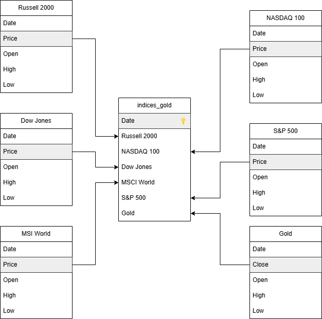
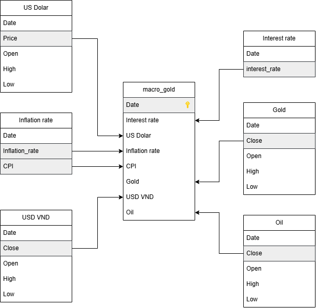
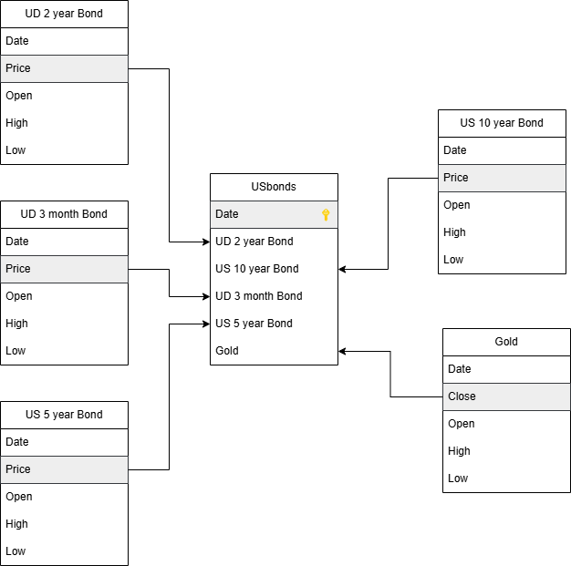

# DATA LAKE FOR MULTIVARIABLE TIME SERIES FORECASTING PROBLEMS IN THE FIELD OF ECONOMY AND FINANCE

## Overview

This project implements a modern data lakehouse platform designed for multivariable time series forecasting in economics and finance. The system combines the flexibility of data lakes with the structured query capabilities of data warehouses to create a robust, scalable architecture for data processing, model training, and visualization.

The platform ingests diverse financial and economic data, processes it through a medallion architecture (bronze, silver, gold), trains advanced machine learning models, and provides insights through interactive dashboards.


## Architecture

The system follows a modular, container-based architecture with the following components:

### Storage Layer
- **MinIO**: S3-compatible object storage for raw, bronze, silver, and gold data layers
- **Nessie**: Git-like version control for data, enabling time travel capabilities

### Processing Layer
- **Apache Spark**: Distributed data processing for ETL pipelines and feature engineering
- **Airflow**: Workflow orchestration for scheduled data pipelines
- **Trino**: SQL query engine for high-performance data analysis

### Analytics & Visualization
- **Cube.js**: Analytics API layer
- **Metabase**: Business intelligence dashboard for data visualization

### Data Pipeline Flow


## Data Layers

The project uses a medallion architecture with clearly defined data layers:

### Bronze Layer (Raw Data)
- Captures raw financial data from Yahoo Finance API
- Preserves original data formats with minimal transformations
- Stores historical market indices, macroeconomic indicators, and US bond data

### Silver Layer (Standardized Data)
- Cleaned and standardized data
- Consistent schema definitions
- Optimized for analytical workloads

### Gold Layer (Business-Ready Data)
- Domain-specific datasets optimized for specific use cases
- Feature-engineered datasets ready for model training
- Pre-aggregated datasets for visualization

## Machine Learning Models

The project implements two advanced models for time series forecasting:

### 1. SrVAR (Sparse Regularized Vector Autoregression)
- Pytorch-based implementation
- Handles high-dimensional multivariate time series data
- Incorporates regularization techniques to manage sparse data
- Separate models for indices, macroeconomic indicators, and US bonds

### 2. VARNN (Vector Autoregressive Neural Network)
- TensorFlow-based implementation
- Deep learning approach combining VAR and neural networks
- Captures complex non-linear relationships in time series data
- Enhanced forecasting accuracy for financial markets

## Data Categories

The system focuses on three main categories of financial and economic data:

### Market Indices


### Macroeconomic Indicators


### US Bonds


## System Components

### Data Collection
- Automated daily scraping of financial data from Yahoo Finance
- Scheduled pipelines for data refresh
- Data quality checks and validation

### Data Processing
- ETL workflows managed by Airflow
- Data transformation using Apache Spark
- Version tracking with Nessie

### Model Training
- Scheduled model retraining pipelines
- Hyperparameter optimization
- Model performance evaluation

### Visualization
- Interactive dashboards with Metabase
- Time series analysis and forecasting visualization
- Key performance indicators for economic metrics

## Data Lake Structure

The project organizes data using a lakehouse structure combining the best aspects of data lakes and data warehouses:


This approach enables:
- Schema enforcement when needed
- ACID transactions
- Versioning and time travel
- High-performance analytics
- Support for both batch and streaming data

## Technology Stack


## Project Structure

```
├── airflow/                # Airflow DAGs and scripts
│   └── dags/               # Workflow definitions
├── cube/                   # Cube.js configuration
├── docs/                   # Documentation resources
├── minio/                  # MinIO configuration
├── models/                 # Model definitions
├── nessie/                 # Nessie configuration and scripts
├── spark/                  # Spark configuration and scripts
│   ├── conf/               # Spark configuration files
│   └── jars/               # Additional JARs for Spark
├── src/                    # Source code
│   ├── airflow/            # Airflow task implementations
│   ├── data/               # Data directory
│   │   ├── Raw/            # Raw data files
│   │   └── Clean/          # Cleaned data
│   ├── model/              # Trained model files
│   └── notebooks/          # Jupyter notebooks
└── trino/                  # Trino configuration
```


## Support

For support, email luongvudinhduy03@gmail.com